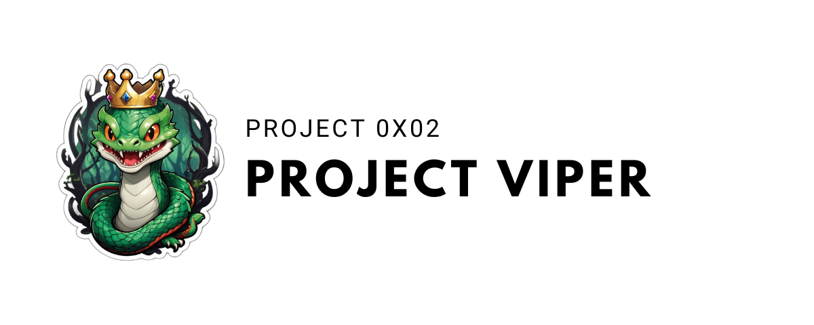

**Project description**

## Contents

1. [Installation](#installation)
2. [Usage](#use)
3. [Contribute](#contribute)
4. [License](#license)

## Installation

## Use

## Contribute

As a reminder, this project is still only a draft, as we are still learning about this provision, any contribution and opinion /improvement of this provision is welcome.

The same goes for adding functionality, don’t hesitate to:

1. Project fork
2. Create a new branch (`git checkout -b feature/new-feature`)
3. Commit your changes (`git commit -am 'Added a new feature'`)
4. Branch push (`git push origin feature/new-feature`)
5. Create a pull request

## License

This project is distributed under the MIT License, a permissive open source license that allows anyone to use, modify and distribute the code, as long as the copyright notice and license are included in all copies or substantial parts of the software. This license is renowned for its simplicity and flexibility, offering great freedom to users.